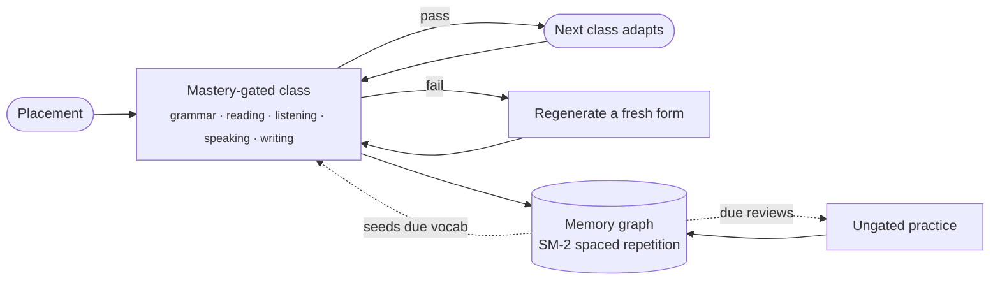

<div align="center">


# Sotto

### Learn a language, taught in your own context.

Open-source, self-hostable language-learning infrastructure — a full **[CEFR](https://www.coe.int/en/web/common-european-framework-reference-languages/level-descriptions) course** built around _your_ work and interests, powered by the AI agent and keys you already own.<br/>Your progress, your data, your models — on a stack **you** control.

<br/>

[](LICENSE)
[](#self-host)
[](#bring-your-own-claude--codex)
[](#bring-your-own-claude--codex)
[](#run-it-100-offline)
[](https://github.com/affromero/Sotto/actions/workflows/ci.yml)
[](https://github.com/affromero/Sotto/actions/workflows/codeql.yml)
[](https://github.com/affromero/Sotto/actions/workflows/gitleaks.yml)
[](.github/dependabot.yml)
[](https://socket.dev)
[](https://nextjs.org)
[](https://react.dev)
[](https://www.typescriptlang.org/)
[](https://prisma.io)
[](https://www.postgresql.org/)
[](CONTRIBUTING.md)
[](https://ko-fi.com/afromero)

<br/>

[**Quick Start**](#quick-start) · [**Why Sotto**](#why-sotto) · [**What You Get**](#what-you-get) · [**Compare**](#how-sotto-compares) · [**Self-host**](#self-host) · [**BYOK**](#bring-your-own-claude--codex)

<sub>Open-source language learning for the context you choose to share.</sub>

</div>

---

## Quick Start

Just Docker — no clone, no build:

```bash
curl -fsSL https://sotto.fm/install.sh | bash
```

The installer pulls the pre-built images, asks how to connect your AI (an API key, your local **Claude Code / Codex** CLI with no key, or your agent on a VPS over SSH), writes config to `~/.sotto`, and starts everything.

**Prefer a one-click app?** Download the desktop installer — macOS `.dmg`, Windows `.exe`, or Linux `.AppImage` — from **[sotto.fm/download](https://sotto.fm/download)**. _Sotto Host_ runs the whole stack for you, no terminal.

1. Open **[localhost:3000](http://localhost:3000)**
2. Take a 2-minute placement test → it puts you at the right CEFR level
3. Start your first mastery-gated class, or sharpen one skill in ungated practice

Manage it from `~/.sotto`: `docker compose logs -f`, `docker compose down`.

---

## Why Sotto?

Every serious language app is closed, hosted, and subscription-funded. Your progress, your vocabulary, and the model that teaches you all live on someone else's servers.

**Sotto inverts that.** You run the whole stack, connect your own Claude or Codex and the context you choose to share, and it builds a course around your work and interests. Your data never leaves infrastructure you control.

> **The differentiators**
>
> - **Taught in your own context** — connect your agent and grant the context you choose (notes, goals, what you're working on); lessons, readings, and listening are drawn from _that_, not generic content.
> - **You own the learning stack** — self-host with your keys, your database, your files. No Sotto account holds your progress hostage.
> - **Pedagogy over gamification** — mastery-gating is [retrieval practice](https://en.wikipedia.org/wiki/Testing_effect); adaptive listening is [comprehensible input](https://en.wikipedia.org/wiki/Input_hypothesis) (Krashen's _i+1_); the memory graph is [SM-2](https://super-memory.com/english/ol/sm2.htm) [spaced repetition](https://en.wikipedia.org/wiki/Spaced_repetition). Progress is measured by demonstrated mastery, not streaks.
> - **Bring your own everything** — LLM, TTS, STT via explicit provider selection, BYOK, or a keyless local agent. You pay your providers directly; nothing is billed through the self-hosted build.

---

## What You Get

A complete CEFR course across **five graded skills**, on a stack you control:

|                  |                                                                                             |
| ---------------- | ------------------------------------------------------------------------------------------- |
| **Grammar**   | Multiple-choice drills with elaborative feedback from your connected LLM                     |
| **Reading**   | Graded passages with comprehension checks + vocabulary extraction                           |
| **Listening** | An adaptive audio episode generated + narrated by your TTS, seeded with your due vocabulary |
| **Speaking**  | Record → STT → pronunciation scoring with a rubric                                          |
| **Writing**   | Free-text tasks graded synchronously with inline AI corrections (old → new + why)           |

…and the rest of the loop:

- **Mastery-gated classes** — you can't advance until you pass; failed sections regenerate in a _similar-but-not-identical_ form (retrieval practice / anti-copy).
- **Ungated practice** — drill any single skill on your own time, spaced-repetition-driven, separate from the graded classes.
- **Personal memory graph** — a per-course, [Obsidian](https://obsidian.md/)-style vocabulary/grammar graph with [SM-2](https://super-memory.com/english/ol/sm2.htm) spaced repetition that drives review, seeds the listening episode, and renders as an interactive [Cytoscape](https://js.cytoscape.org/) visualization.
- **Sourced classes** — build a class from a real article, paper, or YouTube link (or a topic from your interests). Sotto extracts it, levels it to your CEFR, and teaches from it with verified `[N]` citations.
- **Live conversation** — speak and hear the real-time translation (either direction) through the [Gemini Live API](https://ai.google.dev/gemini-api/docs/live); new words you hit feed straight into your memory graph. Runs on your own Google key (added in Settings), and stays hidden until you add one.
- **Practice exams** — full, multi-section mock exams modeled on each language's flagship ([Goethe-Zertifikat](https://www.goethe.de/en/spr/kup/prf.html), [DELE](https://examenes.cervantes.es/), [Cambridge English](https://www.cambridgeenglish.org/), or a generic CEFR mock), with a mock band and section-by-section feedback. Practice only — never an official score, and never changes your level.
- **Notes that personalize everything** — tell Sotto your goals and background once; it threads through placement, classes, and practice.
- **Any language pair** — German/English/Spanish ship as hand-authored reference curricula; any other native→target pair is composed by your connected agent on demand.
- **iPad workbooks** — a Pencil-first PDF workbook for any class: cover, class map, full-page reading/writing/speaking space, QR/deep links back to the web class, and a server-rendered PDF that feels closer to GoodNotes than a handout.

---

## The Learning Loop



Everything a learner does — classes and practice alike — feeds one course-scoped memory graph. Due and weak items resurface in the next class's adaptive content and in practice.

---

## How Sotto Compares

The newest wave is LLM-native, and the closest peer is genuinely good: [**OpenLingo**](https://github.com/pretzelai/openlingo) is also open-source ([MIT](https://github.com/pretzelai/openlingo/blob/main/LICENSE)), self-hostable, and BYO-LLM, with [SM-2](https://super-memory.com/english/ol/sm2.htm) spaced repetition, [Whisper](https://openai.com/research/whisper) speaking feedback, and a nearly identical stack ([Next.js](https://nextjs.org/) 16 / [React](https://react.dev/) 19 / [PostgreSQL](https://www.postgresql.org/) 16). Credit where due. **Where Sotto goes further:** a structured, [mastery-gated](https://en.wikipedia.org/wiki/Mastery_learning) CEFR course across five _graded_ skills (including writing with inline corrections and rubric-based pronunciation scoring), a **[keyless local-agent](#bring-your-own-claude--codex) path** (run it through your own Claude Code / Codex with no API key), a **[100%-offline path](#run-it-100-offline)** (local LLM + STT + TTS — no cloud key for _any_ layer), an interactive memory-graph, and adaptive listening seeded by your due vocabulary.

| Capability                                                                                                                              |               Sotto                | [OpenLingo](https://github.com/pretzelai/openlingo) | [Duolingo](https://www.duolingo.com) | [Speak](https://www.speak.com) | [Praktika](https://praktika.ai) | [TalkPal](https://talkpal.ai) | [Pimsleur](https://www.pimsleur.com) |
| --------------------------------------------------------------------------------------------------------------------------------------- | :--------------------------------: | :-------------------------------------------------: | :----------------------------------: | :----------------------------: | :-----------------------------: | :---------------------------: | :----------------------------------: |
| Open source                                                                                                                             |                 ✅                 |                         ✅                          |                  ❌                  |               ❌               |               ❌                |              ❌               |                  ❌                  |
| Self-hostable                                                                                                                           |                 ✅                 |                         ✅                          |                  ❌                  |               ❌               |               ❌                |              ❌               |                  ❌                  |
| BYOK / own API keys                                                                                                                     |                 ✅                 |                         ✅                          |                  ❌                  |               ❌               |               ❌                |              ❌               |                  ❌                  |
| Bring your own agent ([Claude Code](https://docs.anthropic.com/en/docs/claude-code) / [Codex](https://github.com/openai/codex), no key) |                 ✅                 |                         ❌                          |                  ❌                  |               ❌               |               ❌                |              ❌               |                  ❌                  |
| Runs 100% offline ([local LLM](#run-it-100-offline) + STT + TTS, no cloud key)                                                          |                 ✅                 |                         〰️                          |                  ❌                  |               ❌               |               ❌                |              ❌               |                  ❌                  |
| Multi-user households on your server ([invite your family](#your-devices-and-household))                                                |                 ✅                 |                         〰️                          |                  ❌                  |               ❌               |               ❌                |              ❌               |                  ❌                  |
| 5 _graded_ skills (grammar / reading / listening / speaking / writing)                                                                  |                 ✅                 |                         〰️                          |                  〰️                  |               〰️               |               〰️                |              〰️               |                  〰️                  |
| Mastery-gated progression                                                                                                               |                 ✅                 |                         ❌                          |                  〰️                  |               ❌               |               ❌                |              ❌               |                  〰️                  |
| [Spaced repetition](https://en.wikipedia.org/wiki/Spaced_repetition) (SM-2)                                                             |                 ✅                 |                         ✅                          |                  〰️                  |               ❌               |               ❌                |              ❌               |                  〰️                  |
| Interactive memory graph                                                                                                                |                 ✅                 |                         ❌                          |                  ❌                  |               ❌               |               ❌                |              ❌               |                  ❌                  |
| Adaptive listening seeded by due vocab                                                                                                  |                 ✅                 |                         〰️                          |                  ❌                  |               ❌               |               ❌                |              ❌               |                  〰️                  |
| Classes from your own sources, with verified `[N]` citations                                                                            |                 ✅                 |                         ❌                          |                  ❌                  |               ❌               |               ❌                |              ❌               |                  ❌                  |
| Institutional-style practice exams (Goethe / DELE / Cambridge format)                                                                   |                 ✅                 |                         ❌                          |                  〰️                  |               ❌               |               ❌                |              ❌               |                  ❌                  |
| Live spoken translation practice                                                                                                        |                 ✅                 |                         ❌                          |                  ❌                  |               〰️               |               〰️                |              〰️               |                  ❌                  |
| Rubric pronunciation scoring                                                                                                            |                 ✅                 |                         〰️                          |                  〰️                  |               ✅               |               ✅                |              ✅               |                  ❌                  |
| Price                                                                                                                                   | Self-host (pay providers directly) |                     Free (MIT)                      |            Freemium + sub            |              Sub               |               Sub               |              Sub              |                 Sub                  |

<sub>✅ yes · 〰️ partial · ❌ no. Values reflect each project's public repo/site (June 2026). OpenLingo: verified against [`pretzelai/openlingo`](https://github.com/pretzelai/openlingo) — it has STT speaking feedback (Whisper) and SM-2 SRS, but no rubric pronunciation score, mastery gates, or memory-graph. _Offline:_ OpenLingo's BYO-LLM can point at a local model, but its speaking feedback uses cloud Whisper — so it earns 〰️; Sotto runs LLM **and** STT **and** TTS locally for a true no-cloud-key stack. The closed apps are hosted-only and subscription-funded. Sotto values reflect the self-hosted OSS build; corrections welcome via PR.</sub>

---

## Concepts

A quick map of the nouns you'll meet in the app and the code:

| Term | What it is |
|------|-----------|
| **Course** | Your enrollment in one language pair at a CEFR level (say, German-from-English at B1). You can hold several at once; everything below is scoped to a course. |
| **Class** | A mastery-gated unit of study, roughly an hour's work, built from the five skill **sections**. You can't advance until you pass, and a failed section regenerates in a similar-but-not-identical form. |
| **Section** | One skill inside a class: grammar, reading, listening, speaking, or writing. The listening section plays an Episode; the rest are drills, passages, recordings, or writing tasks. |
| **Episode** | The generated, narrated **audio** a listening section plays: a short script written for your level, seeded with your due vocabulary, and voiced by your TTS. It is the audio unit (the same engine powers any audio Sotto makes), private to you. |
| **Lesson** | A node in the fixed CEFR **curriculum** that sets what a class is about (its grammar points, vocabulary themes, can-do goal). Hand-authored for German/English/Spanish; composed by your agent for any other pair. |
| **Practice** | Ungated, single-skill drilling on your own time, driven by spaced repetition. Separate from the graded classes, and it never gates progress. |
| **Exam** | A full, multi-section **mock exam** modeled on a flagship's format (Goethe / DELE / Cambridge, or a generic CEFR mock). Practice only: a mock band plus feedback, never an official score, and it never changes your level. |
| **Memory graph** | Your per-course vocabulary and grammar with SM-2 spaced repetition. It decides what's due, seeds the next listening Episode, and renders as an interactive graph. |

> The audio entity is called **Episode** rather than Lesson or Class because those two words were already taken: `Lesson` is the curriculum node and `Class` is the gated unit. Episode keeps the model unambiguous.

---

## Architecture

```
apps/web          Next.js 16 App Router — web UI, API routes, Prisma schema, Vitest tests
apps/desktop      Tauri launcher — runs the whole self-hosted stack on your machine, no terminal
tui               sotto — a headless terminal client (Rust): learn from your terminal, tmux-friendly
packages/shared   Shared types, Zod schemas, brand copy
packages/mcp      MCP server — exposes Sotto tools to Claude Code / Codex locally
```

> **Prefer the terminal?** `sotto` ([`tui/`](tui/README.md)) is a keyboard-driven TUI client — vocab SRS, listening/speaking, classes, exams, and native audio in a single pane. `cargo install sotto-tui` (the installed command is `sotto`), then `sotto login` with a token from the web app's `/settings/devices`.

<details>
<summary><b>Runtime stack</b></summary>

<br>

- **[PostgreSQL](https://www.postgresql.org/) 16 + [Prisma](https://www.prisma.io/) 7** — user data, vocabulary graph, progress (via a node-postgres driver adapter).
- **[Redis](https://redis.io/) 7 + [BullMQ](https://docs.bullmq.io/)** — all heavy async work (generation, scoring, audio stitching).
- **Provider-resolved AI / TTS / STT** — explicit resolvers (`resolveLearningAi`, `resolveTtsProvider`, `resolveSttProvider`) pick the configured provider, never by key availability.
- **Keyless local agent** — `AI_PROVIDER=claude-code` (or `codex`) routes every LLM call through your local CLI; no outbound API key required.
- **[MCP](https://modelcontextprotocol.io/) server** (`packages/mcp`) — your local agent calls `ingest_agent_output` and other Sotto tools directly.
- **Web + PWA** — [Next.js](https://nextjs.org/) + [React](https://react.dev/), installable from any browser; a [Tauri](https://tauri.app/) desktop launcher runs the stack locally with no terminal.

</details>

---

## Self-host

### One command (recommended)

```bash
curl -fsSL https://sotto.fm/install.sh | bash
```

During install you choose how Sotto reaches your AI:

- **An API key** (OpenAI or Anthropic) — simplest.
- **Your local Claude Code / Codex CLI** — bring your own agent; it passes your credentials into the container, no API key.
- **Your agent on a VPS, over SSH** — Sotto runs `ssh you@vps claude ...` for every LLM call (`CLAUDE_CODE_SSH_HOST`), so your data can stay on your machine.

### From source (contributors)

Prerequisites: [Node.js](https://nodejs.org/) 22+, [Docker](https://www.docker.com/), [FFmpeg](https://ffmpeg.org/).

```bash
git clone https://github.com/affromero/Sotto.git
cd Sotto
npm run setup     # deps, .env.local (BYOK_ENCRYPTION_KEY), Postgres + Redis, schema, seed
npm run dev
```

Then open **[localhost:3000](http://localhost:3000)**.

### Run it 100% offline

No cloud key for _any_ layer — the LLM, speech-to-text, and text-to-speech all run on your own hardware. One opt-in profile brings up [Ollama](https://ollama.com/) (LLM), [faster-whisper](https://github.com/SYSTRAN/faster-whisper) (STT), and the bundled [Kokoro](https://github.com/hexgrad/kokoro) TTS sidecar:

```bash
docker compose --profile local up -d        # ollama + whisper + kokoro
docker exec sotto-ollama ollama pull qwen3   # any multilingual model: qwen3 / gemma3 / llama3.3
```

Then point Sotto at them (in `.env.local`) — explicit selection, no cloud fallback:

```dotenv
AI_PROVIDER=local    AI_BASE_URL=http://localhost:11434/v1   AI_MODEL=qwen3
STT_PROVIDER=local   STT_BASE_URL=http://localhost:8001/v1   STT_MODEL=deepdml/faster-whisper-large-v3-turbo-ct2
TTS_PROVIDER=kokoro  TTS_BASE_URL=http://localhost:8000
```

Multilingual by design: **Qwen3 / Gemma 3** (100+ languages) for generation, **Whisper large-v3-turbo** (99+) for pronunciation, **Kokoro** (8 languages) for narration. A GPU helps the LLM but isn't required — Whisper and Kokoro are comfortable on CPU. To bring your own local TTS, keep the `TTS_BASE_URL` pattern with `TTS_PROVIDER=local`; your sidecar only needs `GET /health`, `GET /voices`, and `POST /tts`. See [docs/05-provider-extension-guide.md](docs/05-provider-extension-guide.md).

<details>
<summary><b>Bring your own agent / keys (.env.local)</b></summary>

<br>

Route everything through your local Claude, no key:

```dotenv
AI_PROVIDER=claude-code            # or codex
# CLAUDE_CODE_SSH_HOST=you@vps     # ...or your agent on a VPS, over SSH
```

Or one OpenAI key for everything:

```dotenv
AI_PROVIDER=openai
TTS_PROVIDER=openai
STT_PROVIDER=openai
OPENAI_API_KEY=sk-...
```

`.env.oss.example` defaults to local PostgreSQL, local Redis, local file storage under `.sotto/storage`, and payments disabled.

</details>

---

## Your devices and household

The product is self-hosted: you run it, then reach it from anywhere.

- **Desktop.** _Sotto Host_ (a tiny [Tauri](https://tauri.app) launcher in `apps/desktop/`, from **[sotto.fm/download](https://sotto.fm/download)**) runs the whole stack on your computer with no terminal. Open it, click **Start**, and it brings up the containers and opens the app.
- **Web and PWA.** Installable from any browser — add to home screen on a phone, tablet, or laptop for full-screen, offline-capable access against _your_ server.
- **Terminal.** `sotto` is a headless Rust + ratatui client — learn from a tmux pane while you code, with native audio playback and mic recording. See [Terminal client](#terminal-client-sotto) below.
- **Reach it from anywhere.** The installer can open a secure public URL with one command (`cloudflared` quick tunnel, no account), or point a domain at the server and let Caddy handle TLS.

**One learner, no login.** A self-hosted instance is yours alone — open it and you are in, with no sign-up, accounts, or passwords to manage. Your courses, progress, vocabulary graph, and keys live entirely on your own stack.

---

## Learning surfaces

Sotto is one learning system with deliberately different surfaces. The web app is the interactive, graded class. The iPad workbook is the premium Pencil surface for slow study, annotation, and handwriting. The TUI is the headless terminal surface for learners who want the full loop from a tmux pane.

| Surface | Best for | Interaction model | What feels distinct |
| --- | --- | --- | --- |
| **Web / PWA class** | Guided class work, grading, audio, recording, settings, and progress | Touch, mouse, keyboard, mic, browser audio | Live forms, instant feedback, generated listening, speaking submission, writing grading, and advancement gates |
| **iPad workbook PDF** | GoodNotes-style study, handwriting, review, and class handoff | Apple Pencil or stylus on a paginated PDF | Paper-like cover and class map, full-page passages, ruled answer space, writing prompts, speaking prep lines, QR cards, and deep links back into the exact web class section |
| **Terminal client (`sotto`)** | Keyboard-first study while coding or working in a shell | Rust + ratatui, shortcuts, native audio playback, mic capture | Dense single-pane flow, tmux-friendly navigation, local profile switching, and the same `/api/v1` class/practice/exam loop without a browser |

The workbook is intentionally not a web page in disguise. It is generated from the same class contract, but the layout optimizes for Pencil space, page rhythm, and offline annotation. The web class remains the source of truth for audio, recording, grading, regeneration, and progress.

---

## Terminal client (`sotto`)

A premium headless client in `tui/` — the whole platform from a terminal, so you can learn from a tmux split while you code. Pure Rust ([ratatui](https://ratatui.rs)), it talks only to your server's `/api/v1` over HTTP and ships no business logic of its own.

```bash
cargo install --path tui      # builds the `sotto` binary
sotto login                   # redeem a pairing code from Settings -> Devices
sotto                         # launch the TUI against your server
```

- **Everything the web app does** — courses, mastery-gated classes across all five skills, ungated practice, the vocabulary spaced-repetition loop, mock exams, and adaptive listening.
- **Audio in the terminal** — segment playback (rodio) and microphone capture for speaking attempts (cpal -> WAV), uploaded for the same async grading the web app uses.
- **Contextual Q&A** — pause a listening segment and ask a question; the answer streams back inline.
- **Accounts** — `sotto accounts`, `sotto switch`, `sotto logout`, and `sotto whoami` manage multiple servers/profiles (stored in `~/.config/sotto`), plus an in-TUI switcher.

The typed client is generated from the same Zod schemas the web app uses (`packages/shared` -> OpenAPI -> [progenitor](https://github.com/oxidecomputer/progenitor)), so the contract never drifts. See [`tui/CLAUDE.md`](tui/CLAUDE.md) and [§9 of the architecture diagrams](docs/06-architecture-diagrams.md).

---

## Bring your own Claude / Codex

Sotto is built around BYOK from the start, surfaced three ways:

1. **Keyless local agent** — set `AI_PROVIDER=claude-code` (or `codex`) and every LLM call runs through your local [Claude Code](https://docs.anthropic.com/en/docs/claude-code) or [Codex](https://github.com/openai/codex) CLI, no API key. Source-connector readiness is exposed in `apps/web/src/lib/source-connectors.ts`.
2. **[MCP](https://modelcontextprotocol.io/) server** — add `packages/mcp` to your Claude Code or Codex config and call `ingest_agent_output` to push content from any agent workflow straight into Sotto.
3. **BYOK in Settings** — store encrypted per-account API keys (LLM, TTS, STT), encrypted at rest with `BYOK_ENCRYPTION_KEY`. You pay your providers; Sotto is the infrastructure layer.

---

## Status

The full learning loop is shipped and self-hostable today:

- **Clean OSS core** — AGPL-3.0; `.env.oss.example`, `npm run setup`, local-storage default.
- **BYOK / own agent** — keyless `claude-code`/`codex`, encrypted per-account keys, MCP ingestion.
- **Placement → any-language courses** — CEFR placement assigns a level and creates a directed course for any native→target pair.
- **Mastery-gated classes** across all five skills, with similar-but-not-identical regeneration on failure.
- **Ungated practice + learner notes** — per-skill spaced-repetition practice; notes personalize placement, classes, and practice.
- **Vocabulary memory graph** — per-course SM-2 graph, Cytoscape visualization, drives review + adaptive listening.
- **Sourced classes** — build a class from a real article, paper, or YouTube link (or a topic from your interests), leveled to your CEFR with verified `[N]` citations and a sources panel.
- **Practice exams** — full multi-section mock exams modeled on each language's flagship (Goethe / DELE / Cambridge) at your level, with a mock band and per-section feedback. Clearly unaffiliated practice, never an official score.
- **Live conversation** — real-time spoken translation (Gemini Live) on your own Google key; new vocabulary feeds the memory graph.
- **Runs 100% offline** — keyless local LLM, STT, and TTS (Ollama / faster-whisper / Kokoro) via `docker compose --profile local`.
- **Households + your devices** — first account becomes owner, invite your family, fully isolated per-learner accounts; desktop launcher (Sotto Host), installable PWA on any device, one-command secure tunnel.
- **Terminal client** — `sotto`, a Rust + ratatui headless client with in-terminal audio playback and recording; the full learning loop over `/api/v1`.
- **iPad workbooks** — premium Pencil-first PDF workbooks for any class; generated by the web app, ready for GoodNotes-style annotation, and linked back into the exact web class sections.

**Planned (optional managed offering):** hosted infrastructure for non-technical learners — workers, storage, scheduled generation, and provider routing as a convenience layer. The learning stack itself stays open and self-hostable.

---

## Development

```bash
npm run dev           # web + workers
npm run dev:web       # web only
npm run dev:workers   # workers only
npm run build
npm run lint
npm run type-check
npm run test
npm run ci            # lint + type-check + test + build (run before every commit)
```

See **[CONTRIBUTING.md](CONTRIBUTING.md)** to get started.

---

## Related Projects

| Project                                                         | Description                                               |
| --------------------------------------------------------------- | --------------------------------------------------------- |
| [**Flight Finder**](https://github.com/affromero/flight-finder) | Track flight prices over time — self-hosted, BYO-LLM      |
| [**PriceToken**](https://github.com/affromero/pricetoken)       | Real-time LLM pricing API, packages, and live dashboard   |
| [**gitpane**](https://github.com/affromero/gitpane)             | Multi-repo Git workspace dashboard for the terminal       |
| [**kin3o**](https://github.com/affromero/kin3o)                 | AI-powered Lottie animation generator CLI                 |
| [**Splattie**](https://github.com/affromero/splattie)           | Interactive rigged 3D Gaussian assets from a single image |

---

## License

[AGPL-3.0](LICENSE) ([full text](https://www.gnu.org/licenses/agpl-3.0.en.html)) — free to self-host, modify, and redistribute under the same terms. If you run a modified version as a network service, you must publish the source.

<div align="center">
<sub>Built for people who'd rather own their learning than rent it.</sub>
</div>
