# Architecture Diagrams - Sotto

> Visual companion to [01-technical-architecture.md](./01-technical-architecture.md).
> Every diagram below is Mermaid; GitHub and most editors render it inline.
> Kept in sync as each piece lands — see the "sotto terminal client" section for
> the headless `sotto` client.

## 1. System context

How clients reach the system and what the app delegates to.

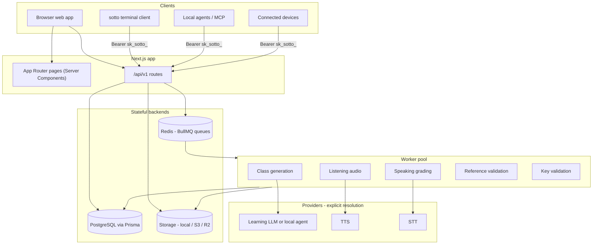

API routes stay thin: validate, check ownership, persist a small change or
enqueue a job. Heavy generation, grading, and stitching run in workers.

## 2. Request and auth flow (trust boundary)

`authenticateRequest()` is Bearer-first with a session fallback. In the
single-learner build `auth()` resolves to the local owner without session
verification, so the API trusts the local owner by construction — a remotely
exposed instance must be gated at the proxy/deploy layer.

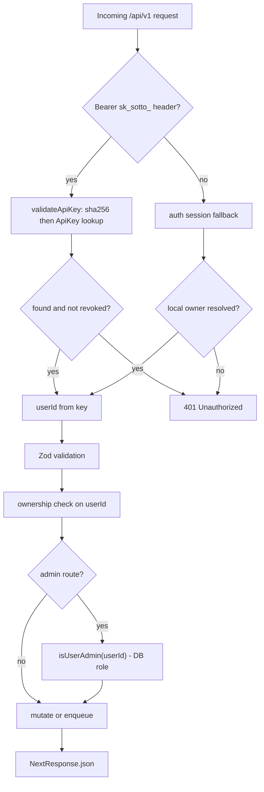

Admin checks key off the authenticated principal (`isUserAdmin(userId)`), not the
ambient session. Session-only `/admin/*` UI routes still use `requireAdmin()`.

### CLI / device pairing to API key

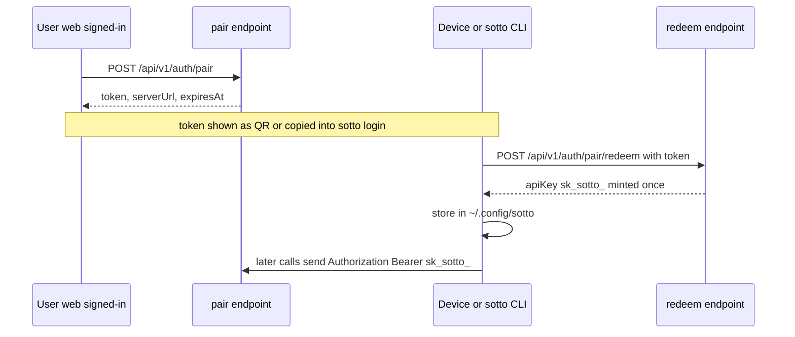

## 3. Monorepo and package dependencies

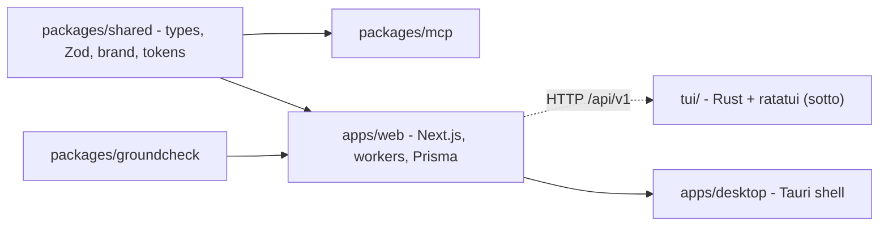

`tui/` consumes the web app over HTTP only — no shared compile-time dependency.
Contract types are generated from the Zod schemas in `packages/shared` (see §9).

## 4. Core learning data model

Key entities and relationships (provider/ops models omitted).

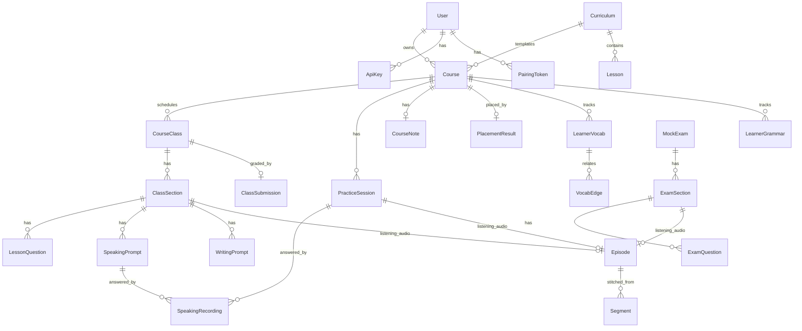

`Episode`/`Segment` is the reused audio engine behind every listening surface
(class listening sections, listening practice, exam listening).

## 5. Class generation pipeline

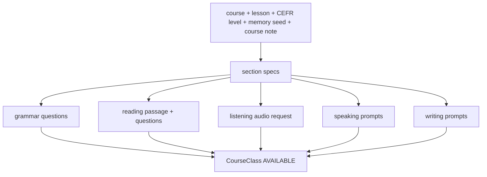

## 6. Listening audio pipeline (status machine)

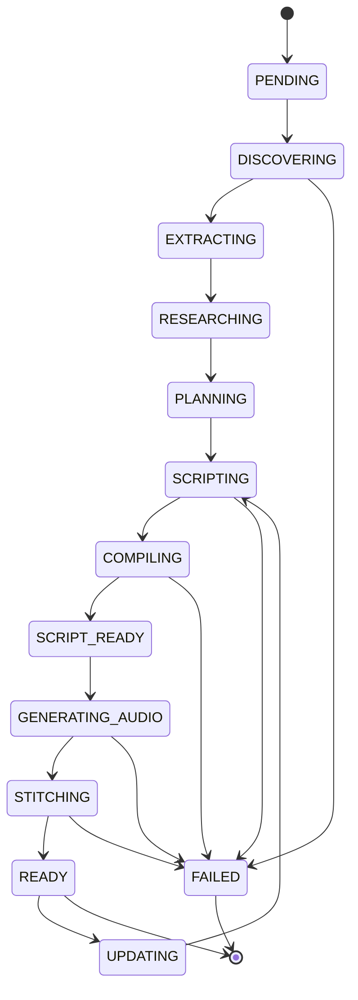

Exact values are the `EpisodeStatus` enum in `schema.prisma`. Script
verification and reference validation run within the `SCRIPTING -> COMPILING`
span (the `script-verification` and `reference-validation` workers), not as
their own statuses. `IMPORTING` and `TRANSCRIBING` are alternate entry points
for imported or transcribed source audio; `UPDATING` is regeneration of an
existing episode.

## 7. Speaking grading flow

Speaking uploads are containerized audio bytes only; `detectAudioFormat()` sniffs
the magic bytes so the stored extension, content type, and STT filename/MIME are
honest (browser WebM, `sotto` CLI WAV).

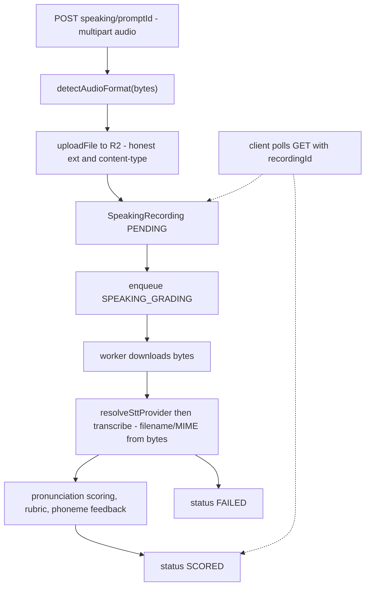

## 8. Provider resolution (explicit, no key-sniffing fallback)

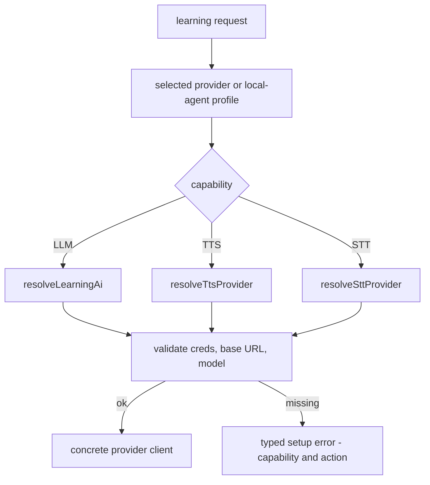

No worker silently routes to a different provider because another key exists.

## 9. sotto terminal client

Premium Rust + ratatui client (the `sotto` binary). HTTP-only against `/api/v1`;
native audio playback and recording; types generated from the Zod-backed OpenAPI
spec. Lives in `tui/`; see `tui/CLAUDE.md` for the crate-level guide.

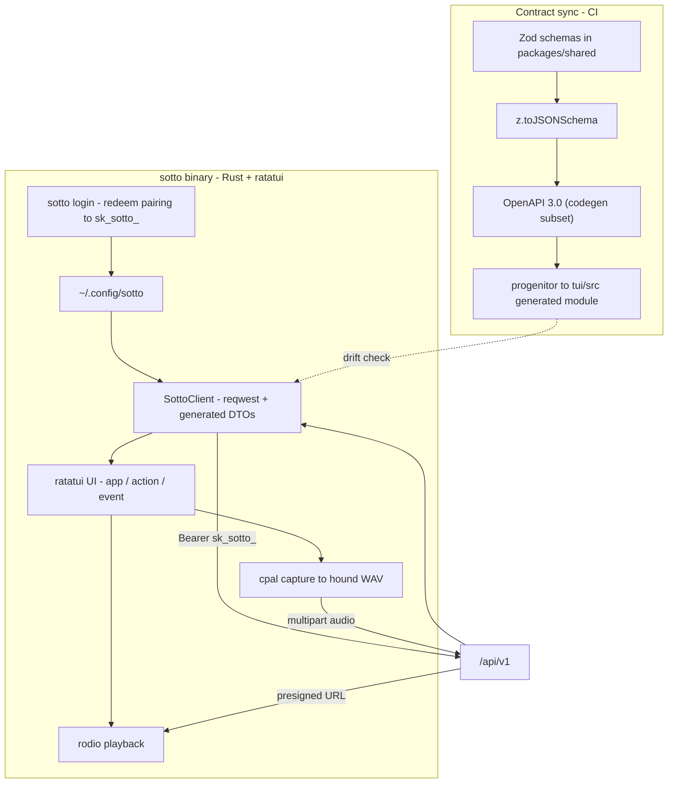

### Vocabulary spaced-repetition loop (first vertical slice)

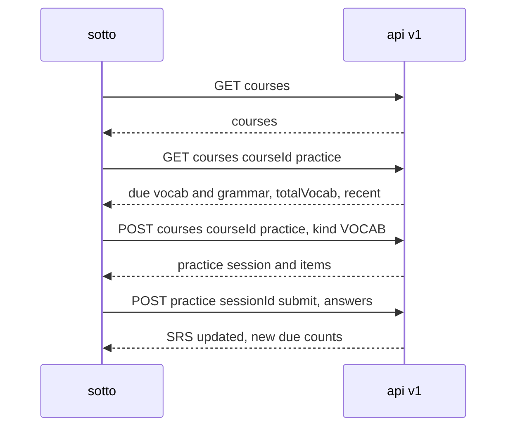
