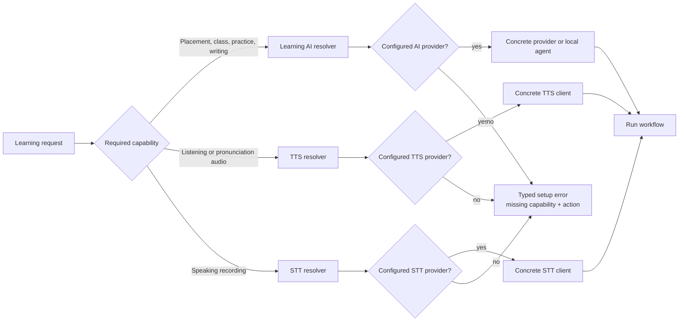
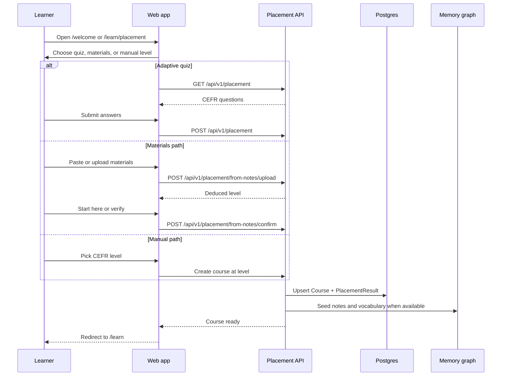
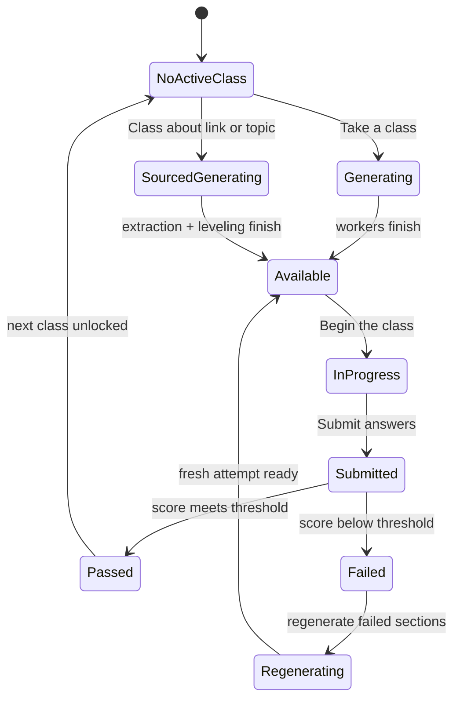
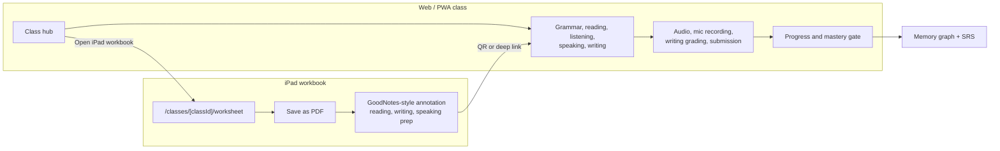
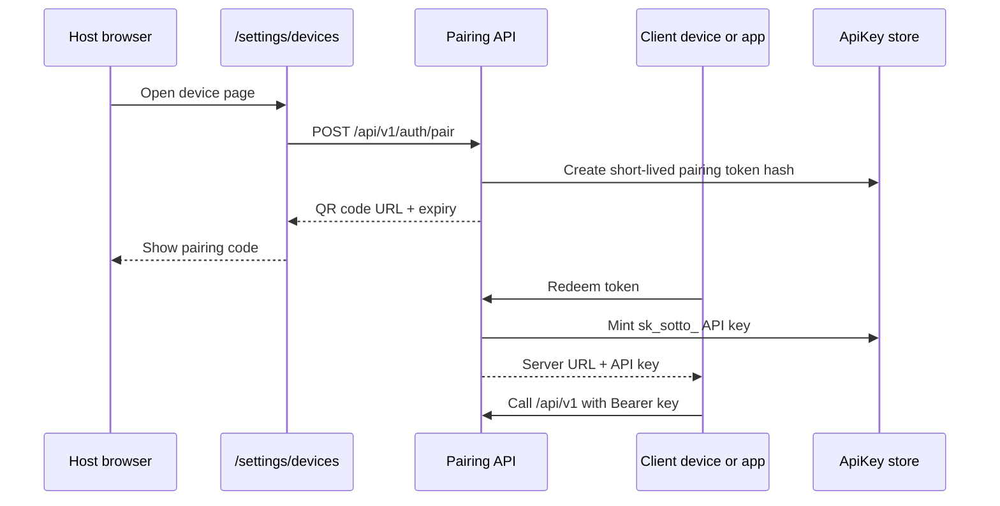

# User Flows - Sotto

**Date:** 2026-06-27

**Summary:** End-to-end learner and operator flows for starting a self-hosted Sotto instance, creating a course, taking classes, using iPad workbooks, connecting devices, and maintaining the private learning stack.

---

## Flow Map

| Goal                           | Start Here                                                 | Main Surface                                                  | Output                                                       |
| ------------------------------ | ---------------------------------------------------------- | ------------------------------------------------------------- | ------------------------------------------------------------ |
| Run Sotto without cloning      | One-command installer                                      | Desktop browser at `http://localhost:3000` or your server URL | Running web app, workers, Postgres, Redis, and local storage |
| Run Sotto from source          | `npm run setup` then `npm run dev`                         | Local development server                                      | Local OSS stack with `.env.local`                            |
| Deploy to a VPS                | [03-self-host-deployment.md](./03-self-host-deployment.md) | Your domain through Caddy                                     | Production self-hosted instance                              |
| Create the first course        | `/welcome` or `/learn/placement`                           | Placement wizard                                              | `Course` plus `PlacementResult`                              |
| Start normal class progression | `/learn` -> `Take a class`                                 | `/learn/class/[classId]`                                      | Mastery-gated `CourseClass`                                  |
| Build a class from a source    | `/learn` -> `Class about...`                               | Link/topic entry on the course card                           | CEFR-leveled sourced class                                   |
| Study on iPad                  | Class hub/history -> `iPad workbook`                       | `/classes/[classId]/worksheet`                                | Printable/annotatable workbook with web deep links           |
| Sharpen one skill              | `/learn/practice`                                          | Practice panel                                                | Ungated practice session and SRS updates                     |
| Rehearse before live speaking  | `/learn/practice` or `/learn/live`                         | Practice runner or live conversation                          | Private attempts and follow-up vocabulary                    |
| Review memory                  | `/memory`                                                  | Cytoscape graph                                               | Course-scoped vocab/grammar SRS view                         |
| Take a mock exam               | `/learn/exams?course=...`                                  | Exam runner                                                   | Self-assessment score and feedback                           |
| Pair clients and devices       | `/settings/devices`                                        | QR pairing/API keys                                           | `sk_sotto_` key for TUI, agents, scripts, or app clients     |
| Plan teacher-run practice      | `/profiles`                                                | Student profile picker                                        | Isolated student profiles today; homework mode planned       |

### End-to-end learner journey

```mermaid
flowchart TD
    start["Start self-hosted Sotto"] --> config["Choose explicit providers<br/>AI, TTS, STT, storage"]
    config --> welcome["Open /welcome<br/>or /learn/placement"]
    welcome --> placement{"Placement path"}
    placement -->|Quiz| quiz["Adaptive CEFR questions"]
    placement -->|Materials| notes["Paste or upload notes<br/>deduce level"]
    placement -->|Manual| manual["Choose known CEFR level"]
    quiz --> course["Course + PlacementResult"]
    notes --> course
    manual --> course
    course --> learn["/learn course card"]
    learn --> class["Mastery-gated class"]
    class --> submit{"Submit class"}
    submit -->|Pass| advance["Next class adapts"]
    submit -->|Fail| regen["Regenerate failed sections"]
    regen --> class
    advance --> learn
    class --> workbook["iPad workbook PDF"]
    class --> memory["Memory graph + SRS"]
    memory --> practice["Ungated practice"]
    practice --> memory
```

## 1. Start the Stack

### One-command self-host

Use this path for a learner who wants Sotto running quickly on their own machine:

```bash
curl -fsSL https://sotto.fm/install.sh | bash
```

The installer should:

1. Pull the self-hosted compose bundle into `~/.sotto`.
2. Ask how Sotto should reach AI, TTS, and STT providers.
3. Write the selected configuration.
4. Start the containers.
5. Open the web app at `http://localhost:3000`.

Manage the local stack from `~/.sotto`:

```bash
docker compose logs -f
docker compose down
docker compose up -d
```

### Desktop launcher

Use Sotto Host when the learner should not touch a terminal:

1. Install the desktop app from `sotto.fm/download`.
2. Open Sotto Host.
3. Click `Start`.
4. Wait for the health check.
5. Use the browser window it opens.

The desktop app still runs the learner's own local stack. It is a launcher, not a hosted account.

### From source

Use this path for contributors and local OSS development:

```bash
git clone https://github.com/affromero/Sotto.git
cd Sotto
npm run setup
npm run dev
```

Then open `http://localhost:3000`.

`npm run setup` installs dependencies, starts Postgres and Redis, creates `.env.local` from `.env.oss.example`, generates local secrets, pushes the Prisma schema, generates the Prisma client, and keeps storage local by default.

### VPS production

Use a single Linux VPS for the default public self-hosted install:

1. Provision Ubuntu 24.04 or equivalent.
2. Point a domain to the server.
3. Create `~/sotto/.env.production`.
4. Configure explicit providers and storage.
5. Run:

```bash
cd ~/sotto
SOTTO_ENV_FILE=~/sotto/.env.production bash scripts/deploy.sh
```

Detailed steps live in [02-hosting-infrastructure.md](./02-hosting-infrastructure.md) and [03-self-host-deployment.md](./03-self-host-deployment.md).

## 2. Configure Providers

Sotto never silently chooses a provider because a key exists. Each capability must be explicit.

| Capability        | Required For                                                              | Typical Setting                                                                                                       |
| ----------------- | ------------------------------------------------------------------------- | --------------------------------------------------------------------------------------------------------------------- |
| Learning AI       | Placement, class generation, writing grading, practice, memory extraction | `AI_PROVIDER=openai`, `AI_PROVIDER=anthropic`, `AI_PROVIDER=claude-code`, `AI_PROVIDER=codex`, or `AI_PROVIDER=local` |
| TTS               | Listening audio, reference pronunciation, spoken feedback                 | `TTS_PROVIDER=openai`, `TTS_PROVIDER=elevenlabs`, `TTS_PROVIDER=kokoro`, or `TTS_PROVIDER=local`                      |
| STT               | Speaking recordings and pronunciation feedback                            | `STT_PROVIDER=openai`, `STT_PROVIDER=elevenlabs`, `STT_PROVIDER=local`, or another supported STT provider             |
| Storage           | Audio, recordings, workbooks, media exports                               | `STORAGE_PROVIDER=local`, `s3`, or `r2`                                                                               |
| Live conversation | `/learn/live` only                                                        | BYOK Google key with Gemini Live access                                                                               |

Smallest hosted-provider path:

```env
AI_PROVIDER=openai
TTS_PROVIDER=openai
STT_PROVIDER=openai
OPENAI_API_KEY=sk-...
```

Keyless local-agent path:

```env
AI_PROVIDER=claude-code
TTS_PROVIDER=openai
STT_PROVIDER=openai
OPENAI_API_KEY=sk-...
```

Use `AI_PROVIDER=codex` for Codex CLI. CLI model options are discovered from saved setup selections, environment lists such as `CLAUDE_CODE_MODELS` and `CODEX_MODELS`, and local CLI config. Reasoning effort options use `CLAUDE_CODE_EFFORTS` or `CODEX_MODEL_REASONING_EFFORTS`, with per-selection IDs stored as `claude-code:<model>#effort=<level>` or `codex:<model>#effort=<level>`.

Fully local path:

```bash
docker compose --profile local up -d
docker exec sotto-ollama ollama pull qwen3
```

```env
AI_PROVIDER=local
AI_BASE_URL=http://localhost:11434/v1
AI_MODEL=qwen3

STT_PROVIDER=local
STT_BASE_URL=http://localhost:8001/v1
STT_MODEL=deepdml/faster-whisper-large-v3-turbo-ct2

TTS_PROVIDER=kokoro
TTS_BASE_URL=http://localhost:8000
```

Provider-extension details live in [05-provider-extension-guide.md](./05-provider-extension-guide.md).

### Provider readiness flow



## 3. First Course Happy Path

### New learner

1. Open the running app.
2. Complete `/welcome`.
3. Choose native language, target language, course context, and provider settings.
4. Complete placement.
5. Land on `/learn` with the new course.

If the welcome wizard is already complete, use `/learn` -> `+ Start a new course`, which opens `/learn/placement`.

### Placement options

| Option           | UI Label                         | Best For                                           | Result                                                                   |
| ---------------- | -------------------------------- | -------------------------------------------------- | ------------------------------------------------------------------------ |
| Adaptive quiz    | `Take the placement test`        | New learner with no material to import             | Generates questions, submits answers, creates or raises the course level |
| Materials import | `I have materials from my level` | Learner with notes, lessons, writing, or files     | Deduces level, offers `Start here` or `Verify with a few questions`      |
| Manual level     | `I already know my level`        | Fast start when the learner knows their CEFR level | Creates the course at the chosen level                                   |

Placement can raise a learner's current course level. It should not lower a level the learner has already reached.

### Course context

After the course exists, use the course notes panel on `/learn` to paste goals, classroom notes, official course material, or interests. Course notes shape placement, class generation, practice, and vocabulary extraction for that course only.

### Course creation sequence



## 4. Normal Class Flow

Start from `/learn`.

1. Pick the course card.
2. Click `Take a class`.
3. Wait while Sotto composes the class.
4. Enter `/learn/class/[classId]`.
5. Begin or resume the class.
6. Complete each generated section.
7. Submit the class.
8. If passed, the course can advance.
9. If failed, regenerate the failed sections and try again.

The class runner handles grammar, reading, listening, speaking, and writing sections when the generated class includes them. The web class is the source of truth for audio playback, microphone recording, writing submission, grading, regeneration, and progress.

Only one active gated class should exist for a course. If a learner tries to start another class while one is active, Sotto sends them back to the active class.

### Class lifecycle



## 5. Sourced Class Flow

Use this when the learner wants a class about a real source or current interest.

1. Open `/learn`.
2. Expand `Class about...` on the course card.
3. Paste an article, paper, or video URL, or choose a suggested topic chip.
4. Sotto extracts readable content, levels it to the learner's CEFR level, and builds the class.
5. The class opens in `/learn/class/[classId]`.
6. The class sources panel shows numbered references and verification status.

Failure states:

| Symptom                                               | Meaning                                      | Next Step                                    |
| ----------------------------------------------------- | -------------------------------------------- | -------------------------------------------- |
| `Finish the current class before starting a new one.` | The course already has an active class       | Resume or submit the active class first      |
| Link cannot be read or leveled                        | The source did not expose enough usable text | Paste a different URL or use a topic instead |
| Generic network error                                 | Browser/server connectivity failed           | Retry after the server is reachable          |

## 6. iPad Workbook Flow

The iPad workbook is for slow study, handwriting, annotation, and handoff back to the web class. It is not the grading surface.

### Open the workbook

From an active class:

1. Open `/learn/class/[classId]`.
2. On the class hub, click `iPad workbook`.

From course history:

1. Open `/learn`.
2. Find the course.
3. Open class history.
4. Click `Workbook`, `Touch workbook`, `iPad workbook`, or `Pencil workbook`.

Those labels all open:

```text
/classes/[classId]/worksheet
```

The label changes based on the device. iPad-like devices see `iPad workbook`; pen input can relabel it as `Pencil workbook`.

### Save or annotate

1. Open the workbook page on the iPad.
2. Tap `Save as PDF`.
3. Use the browser print/share sheet.
4. Save the PDF to Files or open it in GoodNotes, Notability, or another annotation app.
5. Use the workbook for reading, handwriting, speaking prep, and writing drafts.
6. Return to the web class for audio, recording, grading, and final answers.

The workbook includes class metadata, section content, answer space, speaking prompts, writing prompts, and QR/deep links back into the web class. The web class remains authoritative for progress and scoring.

### Script/API path

Clients can fetch the workbook contract and current generated PDF URL:

```http
GET /api/v1/classes/{classId}/worksheet
```

Clients can enqueue server-side PDF generation:

```http
POST /api/v1/classes/{classId}/worksheet
```

The POST returns `202` while the `worksheet-pdf` worker renders and uploads the PDF. If Chromium is unavailable, the print-optimized workbook page still works through browser print.

### Web class and iPad workbook handoff



## 7. iPad, Phone, and PWA Flow

Use `/settings/devices` to get another device onto the same self-hosted stack.

1. Open `/settings/devices` on the host browser.
2. In `Open this server`, scan or copy the server URL for the other device.
3. If the device is away from the local network, use the guided private tunnel or a real domain with Caddy/TLS.
4. Open the server URL from Safari, Chrome, or the Sotto app.
5. For browser/PWA use, add the site to the home screen if desired.
6. For app, TUI, agent, or script clients, generate a one-time pairing code and scan/copy it from the client.

Browser/PWA access uses the web app against the learner's server. API-style clients use the `sk_sotto_` key minted by pairing or by the owner API key manager.

For iPad class work:

1. Use the PWA/web app for `/learn`, class audio, speaking, and grading.
2. Use the workbook PDF for Pencil annotation.
3. Follow QR/deep links from the workbook back to the exact web class when it is time to submit.

Microphone flows work best from HTTPS. A local `localhost` browser works for local testing, but a remote phone or iPad should use a trusted HTTPS origin.

### Device and client pairing



## 8. Practice, Memory, Exams, and Live Conversation

### Practice

Use `/learn/practice` for ungated sessions.

1. Select the course.
2. Choose vocab, grammar, reading, listening, speaking, writing, or full catch-up.
3. Complete the session.
4. Submit.

Practice updates the memory graph and spaced-repetition state. It does not advance the course level or replace the gated class. It is also the low-pressure rehearsal surface: learners can retry speaking, writing, listening, and vocabulary privately before they bring a stronger attempt to a teacher, tutor, classmate, or live conversation.

### Memory graph

Use `/memory` to inspect course-scoped vocabulary and grammar.

The graph combines evidence from classes, practice, live conversation, imported notes, and learning targets. Due or weak items feed future practice and class generation.

### Practice exams

Use `/learn/exams?course=COURSE_ID`.

1. Start the available flagship-style mock exam for the course language.
2. Complete the sections.
3. Submit.
4. Review mock band, section scores, feedback, and answer key.

Practice exams are unaffiliated self-assessment. They never produce an official score and never advance the course level.

### Live conversation

Use `/learn/live?course=COURSE_ID` after adding a Google key with Gemini Live access.

1. Pick the translation direction.
2. Start the mic session.
3. Speak and listen through live translation.
4. End the session.
5. New target-language vocabulary is extracted into the course memory graph.

If the Google key is missing or lacks Live access, the UI should show an unlock/setup state instead of pretending the feature is available.

## 9. Terminal and Agent Flow

### Terminal client

Pair the terminal client from `/settings/devices`:

```bash
cargo install --path tui
sotto login
sotto
```

The TUI talks to the same `/api/v1` contract as the web app. It stores profiles in `~/.config/sotto`, plays audio locally, records speaking attempts, and uploads recordings for the same server-side grading worker.

### Local agents and scripts

Owner-created API keys can be used by local agents, MCP clients, and scripts:

```bash
curl -H "Authorization: Bearer sk_sotto_..." \
  https://your-sotto.example/api/v1/courses
```

Use this path when a local Claude Code, Codex, OpenClaw, Hermes, or custom workflow should push private learning context into Sotto or automate course/practice calls. API keys should be scoped to the owner who created them and revoked from `/settings/devices` when no longer needed.

MCP-capable agents (Claude Desktop, Claude Code, Codex, OpenClaw, Hermes) can use the `@sotto/mcp` server instead of raw HTTP; per-client setup snippets live in `packages/mcp/README.md`.

## 10. Household/Profile Flow

Sotto is private-first and self-hosted. A local install can still have multiple learner profiles inside the household.

1. Open `/profiles` or the profile menu.
2. Add a learner profile.
3. Switch to that profile.
4. Start that learner's own placement and course.
5. Return to `/profiles` to switch learners.

Each profile has its own courses, progress, practice history, and memory graph. Owner-only operations such as API key management remain restricted to the owner/admin profile.

### Planned teacher mode

Teacher mode should extend the profile model without turning Sotto into a replacement teacher:

1. The teacher self-hosts or school-hosts the instance.
2. The teacher creates one profile per student.
3. The teacher assigns homework as private rehearsal: scenarios, target vocabulary, source material, speaking prompts, writing prompts, or catch-up practice.
4. Each student completes the assignment in their own profile, with retries allowed.
5. Sotto captures attempts, scores, difficult words, questions asked, and suggested follow-ups.
6. The teacher reviews the follow-up queue before class and decides what to reteach, skip, or discuss live.

The boundary is intentional. Sotto should help teachers prepare classes and follow up with each student; it should not claim to certify final ability, replace teacher judgment, or make curriculum decisions without teacher review.

## 11. Maintenance Flow

### Local install

```bash
cd ~/.sotto
docker compose logs -f
docker compose pull
docker compose up -d
```

### VPS install

```bash
cd ~/sotto
SOTTO_ENV_FILE=~/sotto/.env.production bash scripts/deploy.sh
```

### Backups

Back up both Postgres and the selected storage backend. A database backup without generated audio, recordings, and workbook files is not a complete restore path.

For the default VPS scripts:

```bash
mkdir -p ~/backups
(crontab -l 2>/dev/null; echo "0 3 * * * ~/sotto/scripts/backup.sh") | crontab -
```

Test restore before treating the deployment as production.

## Troubleshooting

| Problem                              | Check                                                     | Fix                                                                                                        |
| ------------------------------------ | --------------------------------------------------------- | ---------------------------------------------------------------------------------------------------------- |
| App does not open locally            | Containers and port `3000`                                | `docker compose ps`, then `docker compose logs -f`                                                         |
| Setup asks for a provider capability | Explicit `AI_PROVIDER`, `TTS_PROVIDER`, or `STT_PROVIDER` | Set the provider and matching key/base URL                                                                 |
| Class stays in composing/generating  | Redis, worker process, provider logs                      | Start workers with `npm run dev:workers` or inspect compose worker logs                                    |
| Listening audio never becomes ready  | TTS provider and storage                                  | Verify `TTS_PROVIDER`, provider key, `STORAGE_PROVIDER`, and storage write permissions                     |
| Speaking grading fails               | Browser mic permission and STT provider                   | Allow microphone access and verify `STT_PROVIDER`                                                          |
| iPad cannot reach the server         | Network, tunnel, DNS, HTTPS                               | Use `/settings/devices`, a private tunnel, or Caddy with a real domain                                     |
| Workbook print looks wrong           | Browser print settings                                    | Use `Save as PDF`, enable backgrounds if the browser offers it, and use the print-optimized worksheet page |
| Sourced class URL fails              | Source extraction                                         | Try a readable article URL, paste text into course notes, or use a topic chip                              |
| TUI cannot log in                    | Pairing code expiry or server URL                         | Generate a new code from `/settings/devices` and confirm the client can reach the URL                      |
| Live conversation is locked          | Google BYOK key                                           | Add a Google key with Gemini Live access                                                                   |

## Use Case Scripts

### A. First private course on a laptop

1. Install with the one-command script.
2. Choose OpenAI for AI, TTS, and STT.
3. Open `http://localhost:3000`.
4. Complete `/welcome`.
5. Take the placement test.
6. Click `Take a class`.
7. Complete the class sections.
8. Submit.
9. Review new memory items in `/memory`.

### B. Self-host on a domain, then study from iPad

1. Deploy to a VPS using [03-self-host-deployment.md](./03-self-host-deployment.md).
2. Confirm `https://your-domain.example/api/v1/health`.
3. Open `/welcome` and create the first course.
4. Open `/settings/devices` from a desktop browser.
5. Open the server URL on the iPad.
6. Add it to the home screen.
7. From `/learn`, start or resume a class.
8. Open `iPad workbook`.
9. Save as PDF into the annotation app.
10. Use QR/deep links to return to the web class for audio, speaking, writing, and submission.

### C. Build a class from a real source

1. Complete placement for the course.
2. Open `/learn`.
3. Expand `Class about...`.
4. Paste a source URL.
5. Wait for extraction and leveling.
6. Review the generated class.
7. Use the sources panel while answering reading/listening questions.
8. Submit and let the memory graph absorb new items.

### D. Run with no cloud AI

1. Start the local profile with Ollama, faster-whisper, and Kokoro.
2. Set `AI_PROVIDER=local`, `STT_PROVIDER=local`, and `TTS_PROVIDER=kokoro`.
3. Pull a multilingual model in Ollama.
4. Run `npm run dev` or the local compose stack.
5. Create the course and class normally.
6. Expect generation speed to depend on local hardware.

### E. Use terminal study while coding

1. Run the web app.
2. Open `/settings/devices`.
3. Generate a pairing code.
4. Run `sotto login`.
5. Launch `sotto`.
6. Continue the same course, class, practice, or exam from a terminal.

## Completion Checklist

A self-hosted learner flow is fully working when:

- The app opens from the host machine.
- The app opens from the learner's iPad/phone or PWA URL.
- Provider readiness is explicit for AI, TTS, and STT.
- A course can be created through placement or manual level selection.
- `Take a class` creates or resumes a class.
- Listening audio can play.
- Speaking recording can upload and receive a score.
- Writing can be submitted and scored.
- A class can be submitted and pass/fail behavior is visible.
- The workbook opens at `/classes/[classId]/worksheet`.
- `Save as PDF` works from the workbook page.
- QR/deep links return from the workbook to the web class.
- Practice updates due counts or memory state.
- `/memory` shows course vocabulary/grammar.
- `/settings/devices` can mint a pairing code or API key.
- Backups cover both database and storage.
